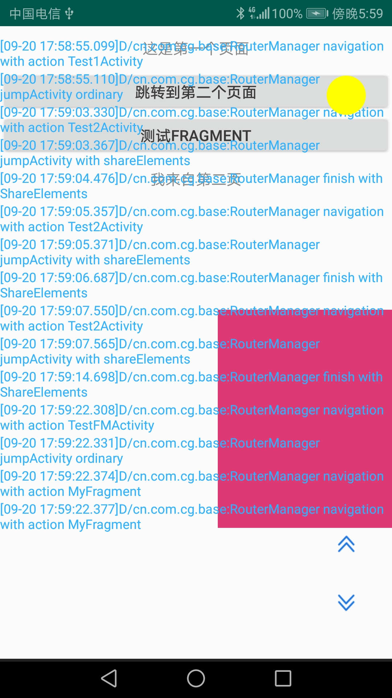

## CRouter

crouter是一款依赖于python和kotlin来设计的android路由框架，主要实现多module之间的完全解耦。其中python版本3.7，kotlin版本1.3.31。

### 主要特色

  由于使用了python在编译时来处理一些过程问题，因此更大化的减少了配置上的步骤。
  新增MVP模板，可通过脚本命令快速创建MVP模板

    ## 例如 在指定包下新增一个Activity或Fragment
         你可以使用如下命令：

    ##   cmd：         python mvp.py com.cg.xqkj.cportal.main Portal Activity
    ##   cmd:          python mvp.py com.cg.xqkj.cportal.main Home Fragment

    ## 命令执行过后，你将可以看到你的MainActivity和HomeFragment被创建完成，并附带创建了m层和p层，以及contract
   

### 设计思路
  
  在编译时，使用python处理所有的注解类，生成相关路由表。在运行时，读取路由表，获得对应类的路由，通过反射机制与相应的类进行通信。

### 功能点：
	## 1.路由寻址 ##
		例如：
	   /**
     	* 通过注解反射跳转到Test2Activity
     	* 支持指定的Intnt.flags
     	* 支持共享元素过度
     	* 支持跳转动画
     	* 支持目标也面向当前页面回调
     	*/
    	private fun gotoT2() {
        	val intent = Intent()
        	intent.flags = Intent.FLAG_ACTIVITY_SINGLE_TOP
        	RouterManager.getInstance()
            	.with(this)
            	.sharedElement(img)
            	.anim(R.anim.slide_in_left,R.anim.slide_out_right)
            	.action("Test2Activity")
            	.intent(intent)
            	.setCallBack(this)
            	.navigation()
    	}

    ## 1.1 路由拦截 ##
    	   支持注入自定义路由拦截器，例如在你的Application代码中新增如下代码：
    	   RouterManager.getInstance().setInterceptor(DefaultRouterInterceptor()).init(this)

	## 2.可视化日志 ##
   
	

 	可视化日志模式下，可以轻易的查看每一步日志，无需连接usb去控制台查看，也无需写入到sdcard中再查看。且日志不影响界面触摸操作，日志不拦截触摸事件。同时，提供上一页，下一页按钮，方便回看。

# 可视化日志触发： #
	
	
在依赖可视化日志包并且初始化后，只需要在屏幕任意空白位置连续快速点击二十次，则会触发可视化日志模式。该模式默认在屏幕右上方显示一个黄色的小圆，点击黄色的圆，则显示日志列表，再次点击，则隐藏日志列表。长按该圆，则结束可视化日志模式。再次点击屏幕空白区域二十次，则再次触发该模式。
	

 
